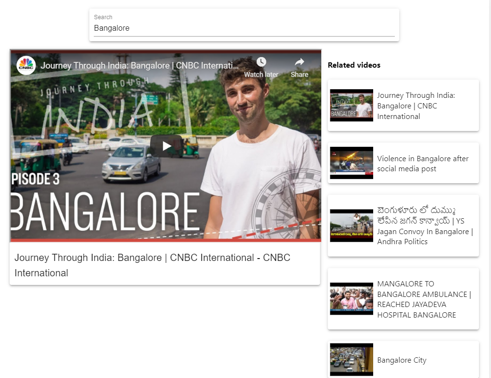

## Project desription:
This is a responsive youtube clone app, where one can search for videos and 5 related videos will be displayed on the side. It makes use of youtube API offered by Google. More features can be added using other information from the API. It is built using **React and Material UI**

## Project preview:
#### https://youtube-clone-1403.netlify.app/

## Snapshots

#### Main page

#### On Mobile

